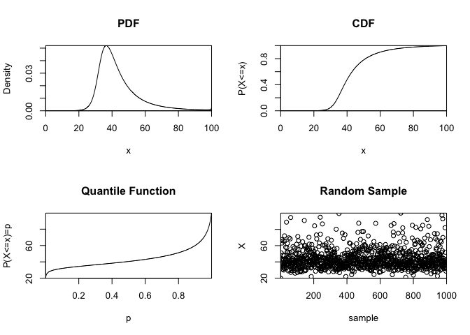

<!-- README.md is generated from README.Rmd. Please edit that file -->

# The Johnson Quantile-Parameterised Distribution

<!-- badges: start -->

<!-- badges: end -->

The goal of `rjqpd` is to implement the Johnson Quantile-Parameterised
distribution system in R. It provides the density function, cumulative
distribution function, quantile function and random sampling function in
their usual form:

  - `djqpd` - calculates the density function (PDF)
  - `pjqpd` - calculates the cumulative distribution function (CDF)
  - `qjqpd` - calculates the quantile function (QF)
  - `rjqpd` - generates random samples

## Background

A common problem in data analysis is encountering continuous
uncertainties that are not easily characterised by well known
parametric, continuous probability distributions. Often the underlying
process that generated the data is unknown or is inconvenient to express
in closed form. In these cases one typically has to resort to curve
fitting a distribution to a set of probability-quantile pairs without
the guarantee that the best-fit distribution will pass through the
assessed points exactly.

The Johnson Quantile-Parameterised Distribution (J-QPD) system is a
novel approach to this problem first developed in a
[paper](https://pubsonline.informs.org/doi/10.1287/deca.2016.0343) by
Hadlock and Bickel (2017) in Decision Analysis Vol. 14, No. 1.

Their approach is to extend the [Johnson Distribution
System](https://en.wikipedia.org/wiki/Johnson's_SU-distribution) in a
way such that the distributions constructed honour exactly a symmetric
percentile triplet of quantile assessments (e.g. 15th, 50th, 85th) on a
bounded or semi-bounded domain. By parameterising the distribution in
this way the need for curve fitting can be eliminated.

## Installation

Install the released version from [CRAN](https://CRAN.R-project.org)
with:

``` r
install.packages("rjqpd")
```

Install the development version from [GitHub](https://github.com/) with:

``` r
remotes::install_github("bobbyingram/rjqpd")
```

## Basic Usage

The base function of the package is the `jqpd` class constructor:

``` r
jqpd()
```

This function takes the convenient symmetric percentile triplet quantile
parameterisation and computes a set of constants required to calculate
the distribution functions.

## Basic Example

This is a basic example to show how to calculate the parameters of a
bounded Johnson Quantile-Parameterised distribution from the quantiles
of a symmetric percentile triplet (SPT).

``` r
library(rjqpd)

# alpha = 0.1 indicates a symmetric percentile triplet (SPT) of (0.1, 0.5, 0.9)
alpha <- 0.1
# we parameterise using some quantile values corresponding to the SPT above.
quantiles <- c(32, 40.5, 60)
params <- jqpd(quantiles, lower = 0, upper = 100, alpha = alpha)

# The CDF should return the (SPT) at the quantile values:
pjqpd(quantiles, params)
#> [1] 0.1 0.5 0.9
```

### Summary Plot

The `plot_jqpd` function produces a simple summary plot showing the
density, cumulative distribution function, quantile function and 1000
random samples:

``` r
plot_jqpd(params)
```



### Summary Statistics

We also provide some basic summary statistics functions:

  - `jqpd_mean` - calculates the mean
  - `jqpd_var` - calculates the variance
  - `jqpd_sd` - calculates the standard deviation
  - `jqpd_skewness` - calculates the skewness
  - `jqpd_kurtosis` - calculates the kurtosis

<!-- end list -->

``` r
jqpd_mean(params)
#> [1] 43.71438
```

``` r
jqpd_var(params)
#> [1] 155.1076
```

``` r
jqpd_sd(params)
#> [1] 12.45422
```

``` r
jqpd_skewness(params)
#> [1] 1.585366
```

``` r
jqpd_kurtosis(params)
#> [1] 6.14006
```
